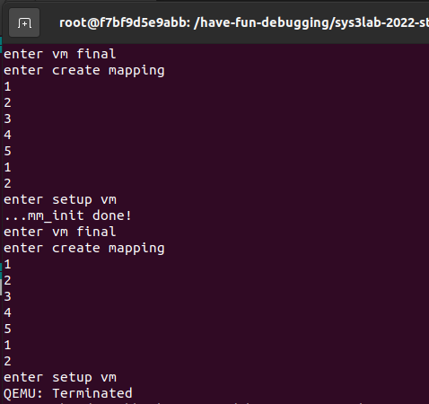
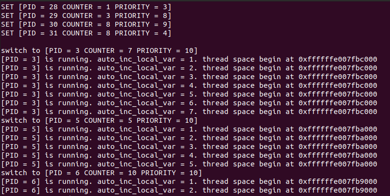
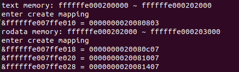

# 实验 3：RV64 虚拟内存管理

## 1. 实验目的

* 学习虚拟内存的相关知识，实现物理地址到虚拟地址的切换。
* 了解 RISC-V 架构中 SV39 分页模式，实现虚拟地址到物理地址的映射，并对不同的段进行相应的权限设置。

## 2. 实验环境

* Docker in Computer System Ⅱ Lab3

## 3. 实验步骤

#### 3.2.1 `setup_vm` 的实现

* 将 0x80000000 开始的 1GB 区域进行两次映射，其中一次是等值映射 ( PA == VA ) ，另一次是将其映射至高地址 ( PA + PV2VA_OFFSET == VA )。如下图所示

	```
	Physical Address
	-------------------------------------------
	                     | OpenSBI | Kernel |
	-------------------------------------------
	                     ^
	                0x80000000
	                     ├───────────────────────────────────────────────────┐
	                     |                                                   |
	Virtual Address      ↓                                                   ↓
	-----------------------------------------------------------------------------------------------
	                     | OpenSBI | Kernel |                                | OpenSBI | Kernel |
	-----------------------------------------------------------------------------------------------
	                     ^                                                   ^
	                0x80000000                                       0xffffffe000000000
	```

- 映射到高地址是为了转化到虚拟地址，而等值映射则是为了保证在转化到虚拟地址前pc运行不会出错。
- 因为现在只是最初的映射，我们采用1GB的superpage的映射，将权限全部赋值为1，为之后严谨的映射做准备。
	1. 由于是进行 1GB 的映射 这里不需要使用多级页表。
	2. 将 va 的 64bit 作为如下划分： | high bit | 9 bit | 30 bit |
	    high bit 可以忽略
	    中间9 bit 作为 early_pgtbl 的 index
	    低 30 bit 作为 页内偏移 这里注意到 30 = 9 + 9 + 12， 即我们只使用根页表， 根页表的每个 entry 都对应 1GB 的区域。所以最开始的映射是1G. 
	3. Page Table Entry 的权限 V | R | W | X 位设置为 1，这里权限设置非常宽松，之后还会细粒度的设置每一个模块的不同权限。

```c
void setup_vm(void) {
	//PHY_START[39:31]=000000010=2
    early_pgtbl[2]=(unsigned long)(0X2<<28) | 0xf;//XWRV=1111
    //VM_START[39:31]=110000000=384
    early_pgtbl[384]=(unsigned long)(0x2<<28) | 0xf;//<<28 -> VPN[2] superpage
}
```

同样的，我们需要在head.s中改写kernel在初始化时做的步骤。

```assembly
_start:
    la sp,boot_stack_top
    call setup_vm
    call relocate
    call mm_init
    call setup_vm_final
    ……
    
relocate:
    # set ra = ra + PA2VA_OFFSET
    # set sp = sp + PA2VA_OFFSET 
    li t1, 0xFFFFFFDF80000000
    add ra, ra, t1
    add sp, sp, t1
    
    # set satp with early_pgtbl
    la t3,  early_pgtbl;
    srli t3, t3, 12; # PPN = PA >>  12
    li t1,  0x8000000000000000
    or t3, t1, t3
    csrw satp, t3
    
    # flush tlb
    sfence.vma zero, zero

    ret
```


#### 4.2.2 `setup_vm_final` 的实现

* 由于 `setup_vm_final` 中需要申请页面的接口， 应该在其之前完成内存管理初始化， 可能需要修改 mm.c 中的代码，mm.c 中初始化的函数接收的起始结束地址需要调整为虚拟地址。
* 以下函数分模块对所有物理内存 (128M) 进行映射，并设置正确的权限，通过`create_mapping`函数来构建映射。

```c
void setup_vm_final(void) {
    memset(swapper_pg_dir, 0x0, PGSIZE);
    // No OpenSBI mapping required
    // mapping kernel text X|-|R|V
    unsigned long va = VM_START + OPENSBI_SIZE;
    unsigned long pa = PHY_START + OPENSBI_SIZE;
    unsigned long text_length = (unsigned long)_srodata - (unsigned long)_stext;
    create_mapping(swapper_pg_dir, va, pa, text_length, 11);//X|-|R|V = 1011

    // mapping kernel rodata -|-|R|V
    va += text_length;
    pa += text_length;
    unsigned long rodata_length = (unsigned long)_sdata - (unsigned long)_srodata;
    create_mapping(swapper_pg_dir, va, pa, rodata_length, 3);//-|-|R|V = 0011
    
    // mapping other memory -|W|R|V
    va += rodata_length;
    pa += rodata_length;
    unsigned long other_length = PHY_SIZE - rodata_length - text_length -OPENSBI_SIZE;
    create_mapping(swapper_pg_dir, va, pa, other_length, 7);//-|W|R|V = 0111
    
    // set satp with swapper_pg_dir
    unsigned long temp = (unsigned long)swapper_pg_dir - PA2VA_OFFSET;
    temp = (unsigned long)temp >> 12;
    temp = (0x000fffffffffff & temp) | 0x8000000000000000;
    csr_write(satp, temp);
    // flush TLB
    asm volatile("sfence.vma zero, zero");
    return;
}
```

- 在这里我采用了输出调试的问题，发现之前经常出现的问题是因为`text_length` `rodata_length`长度设置的问题，导致在create_mapping函数里地址访问错误，会自动跳到程序开始，体现为一直输出mm_init。

#### 4.2.3 `create_mapping ` 的实现

这里我们建立了39位的页表。

```c
     38        30 29        21 20        12 11                           0
     ---------------------------------------------------------------------
    |   VPN[2]   |   VPN[1]   |   VPN[0]   |          page offset         |
     ---------------------------------------------------------------------
                            Sv39 virtual address

```

```c
 55                30 29        21 20        12 11                           0
 -----------------------------------------------------------------------------
|       PPN[2]       |   PPN[1]   |   PPN[0]   |          page offset         |
 -----------------------------------------------------------------------------
                            Sv39 physical address

```

* Sv39 模式定义物理地址有 56 位，虚拟地址有 64 位。但是，虚拟地址的 64 位只有低 39 位有效（==由模式决定==），通过 虚拟内存布局图我们可以发现 其 63-39 位 为 0 时代表 user space address， 为 1 时 代表 kernel space address。Sv39 支持三级页表结构，VPN[2-0](Virtual Page Number)分别代表每级页表的`虚拟页号`，PPN[2-0](Physical Page Number)分别代表每级页表的`物理页号`。物理地址和虚拟地址的低12位表示页内偏移（page offset）。

在Sv39模式中建立页表的步骤有以下几步：

1. 一共有3级页表，优先级顺序为vpn[2], vpn[1], vpn[0].
2. 查看本级页表va对应的地址index位是否有效，若有效则证明在此虚拟地址空间已有分配过内存，可以直接访问。若没有则需要新申请一段内存，并将页表项改写为有效。
3. 读出在vpn作为index时本级页表的ppn以及权限flag，若为vpn[0]则可以直接将ppn[0]+offset拼接访问到物理地址，若不为vpn[0]或权限位flag都为0则继续访问下一层页表目录。最终将物理地址分配好后写入地址和权限位。

```c
create_mapping(uint64 *pgtbl, uint64 va, uint64 pa, uint64 sz, int perm) {
	unsigned long va_temp, pa_temp;
    for(va_temp=va,pa_temp=pa; va_temp < va+sz; va_temp += PGSIZE, pa_temp += PGSIZE){
        unsigned long *cur_page_addr, *cur_pte_addr, cur_pte_data;
        cur_page_addr=pgtbl;
        for(int level = 2; level > 0 ; level--){
            if(level==2){
            //VPN[2]->PPN[1]
            cur_pte_data = cur_page_addr[(va_temp>>30) & (PGNUM-1)];//va[39:31]=VPN[2]
            cur_pte_addr = &cur_page_addr[(va_temp>>30) & (PGNUM-1)];
            }
            else if(level==1){
            //VPN[1]->PPN[0]
            cur_pte_data = cur_page_addr[(va_temp>>21) & (PGNUM-1)];//va[30:22]=VPN[1]
            cur_pte_addr = &cur_page_addr[(va_temp>>21) & (PGNUM-1)];
            }
            if((cur_pte_data&1)){//valid, then find next page table entry
                cur_page_addr = (unsigned long *)(((cur_pte_data>>10)<<12) + PA2VA_OFFSET);//cur_page_data[54:11]=PPN2
            }
            else {//not valid
                cur_page_addr = (uint64 *)kalloc();
                memset(cur_page_addr, 0, PGSIZE);
                WritePTE(cur_pte_addr, ((unsigned long)cur_page_addr - PA2VA_OFFSET)>>12, 0, 1);
                //malloc new page and set entry
            }
        }
        //write VPN[0]
        WritePTE(&cur_page_addr[(va_temp>>12) & (PGNUM-1)], (pa_temp)>>12, perm, 1);
    }
}
```


### 4.3 编译及测试

```
docker start oslab1
docker exec -it oslab1 bash
cd hav/sys3/lab3
make debug
```

```
docker exec -it oslab1 bash
riscv64-unknown-linux-gnu-gdb vmlinux

target remote:1234
退出 QEMU 的方法为：使用 Ctrl+A，松开后再按下 X 键即可退出 QEMU
```

##### 遇到问题

开始设置有问题，一直在输出mm_init，采取输出调试，发现是在create_mapping时第二次页表分配赋值时出错，怀疑是地址设置错误。



于是输出`text`， `rodata`地址，发现地址并不对齐，也不是预期的设置0x1000的空间。在更改了段地址设置后程序运行成功。

#### 实验结果



## 4. 思考题

1. 验证 `.text`, `.rodata` 段的属性是否成功设置，给出截图。

  在输入分配之后，我们将分配地址及分配地址上的数据输出，可以发现，其末尾位被置为了。

  

  

2. 为什么我们在 `setup_vm` 中需要做等值映射?

	因为在刚切换到虚拟内存的时候，pc还没有切换到虚拟地址上，pc会在物理地址上继续读取指令，因此如果我们不进行等值映射，pc在读取指令的时候会发生错误。

	我们所做的等值映射是为了在pc切换到虚拟地址之前保证程序不发生错误，而实际上只会部分等值映射的内存被使用，大部分是无效的，为提升效率我们直接映射1GB。

3. 在 Linux 中，是不需要做等值映射的。请探索一下不在 `setup_vm` 中做等值映射的方法。

	可以在遇到硬件报错page fault的时候，在中断处理程序中将pc加上PA2VA_OFFSET将pc指向虚拟地址页继续运行。