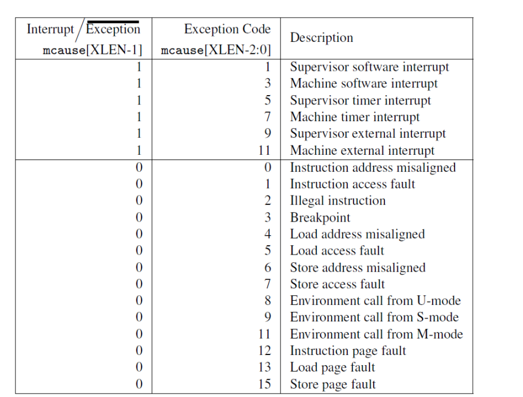
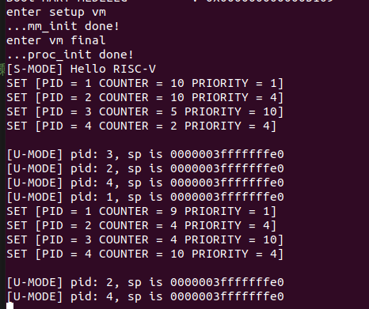

# 实验 4：RV64 用户模式

##  实验目的

* 创建用户态进程，并设置 `sstatus` 来完成内核态转换至用户态。
* 正确设置用户进程的**用户态栈**和**内核态栈**， 并在异常处理时正确切换。
* 补充异常处理逻辑，完成指定的系统调用（ SYS_WRITE, SYS_GETPID ）功能。

##  实验环境

* Docker in Computer System Ⅱ Lab3

## 背景知识

### User 模式基础介绍

处理器具有两种不同的模式：用户模式和内核模式。在内核模式下，执行代码对底层硬件具有完整且不受限制的访问权限，它可以执行任何 CPU 指令并引用任何内存地址。在用户模式下，执行代码无法直接访问硬件，必须委托给系统提供的接口才能访问硬件或内存。处理器根据处理器上运行的代码类型在两种模式之间切换。应用程序以用户模式运行，而核心操作系统组件以内核模式运行。

### 系统调用约定

系统调用是用户态应用程序请求内核服务的一种方式。在 RISC-V 中，我们使用 `ecall` 指令进行系统调用。当执行这条指令时处理器会提升特权模式，跳转到异常处理函数处理这条系统调用。

Linux 中 RISC-V 相关的系统调用可以在 `include/uapi/asm-generic/unistd.h` 中找到，[ syscall(2) ](https://man7.org/linux/man-pages/man2/syscall.2.html)手册页上对RISC-V架构上的调用说明进行了总结，系统调用参数使用 a0 - a5 ，系统调用号使用 a7 ， 系统调用的返回值会被保存到 a0, a1 中。

### sstatus[SUM] PTE[U]

当页表项 PTE[U] 置 0 时，该页表项对应的内存页为内核页，运行在 U-Mode 下的代码**无法访问**。当页表项 PTE[U] 置 1 时，该页表项对应的内存页为用户页，运行在 S-Mode 下的代码**无法访问**。如果想让 S 特权级下的程序能够访问用户页，需要对 sstatus[SUM] 位置 1 。但是无论什么样的情况下，用户页中的指令对于 S-Mode 而言都是**无法执行**的。 

### 用户态栈与内核态栈

当用户态程序在用户态运行时，其使用的栈为**用户态栈**，当调用 SYSCALL时候，陷入内核处理时使用的栈为**内核态栈**，因此需要区分用户态栈和内核态栈，并在异常处理的过程中需要对栈进行切换。

## 实验步骤

### 创建用户态进程

修改 task_init

* 对每个用户态进程，其拥有两个 stack： `U-Mode Stack` 以及 `S-Mode Stack`， 其中 `S-Mode Stack` 在系统二实验六中我们已经设置好了。我们可以通过 `kalloc` 接口申请一个空的页面来作为 `U-Mode Stack` （需要区分好 `U-Mode Stack` 在 `kalloc` 时的地址 / 在用户态下的地址 / 真实物理地址 之间的区别，见下图）。
* 为每个用户态进程创建自己的页表并将 `uapp` 所在页面、以及 `U-Mode Stack` 做相应的映射。
* 为了避免 `U-Mode` 和 `S-Mode` 切换的时候切换页表，我们也将内核页表 （ `swapper_pg_dir` ） 复制到每个进程的页表中。
* 对每个用户态进程我们需要将 `sepc` 修改为 `USER_START`， 设置 `sstatus` 中的 `SPP` （ 使得 sret 返回至 U-Mode ）， `SPIE` （ sret 之后开启中断 ）， `SUM` （ S-Mode 可以访问 User 页面 ）， `sscratch` 设置为 `U-Mode` 的 sp，其值为 `USER_END` （即  `U-Mode Stack` 被放置在 `user space` 的最后一个页面）。

```c
for(int i = 1; i < NR_TASKS; i++) {    
	task[i] = (struct task_struct *)kalloc(); 
    task[i]->state =  TASK_RUNNING;
    task[i]->counter = 0;
    task[i]->priority = rand();
    task[i]->pid = i;
    task[i]->thread.ra = __dummy;
    task[i]->thread.sp = (uint64)task[i] + PGSIZE;

    //set SUM(bit 18, so kernel mode can access user mode page), 
    //set SPIE(bit 5, so interruption is enabled after sret), 
    //set SPP to be 0, so after calling mret, the system can return to user mode 
    task[i]->thread.sstatus =  csr_read(sstatus);
    task[i]->thread.sstatus = task[i]->thread.sstatus | 0x00040020; 
    csr_write(sstatus, task[i]->thread.sstatus); 

    task[i]->thread.sepc =  USER_START;
    task[i]->thread.sscratch = USER_END;


    unsigned long * user_stack = kalloc();//用户栈的物理地址
    unsigned long* rootPGT = kalloc();////页表的物理地址 

    task[i]->pgd = (unsigned long)rootPGT - PA2VA_OFFSET;
    for (int i = 0; i < 512; i++)
    {
        rootPGT[i] =  swapper_pg_dir[i];
    }

    //create_mapping(uint64 *pgtbl, uint64 va, uint64 pa, uint64 sz, int perm)
    create_mapping(rootPGT,  USER_END-PGSIZE ,  (unsigned long )user_stack - PA2VA_OFFSET,  PGSIZE , 0b10111);
    create_mapping(rootPGT,  USER_START ,  (unsigned long)uapp_start-PA2VA_OFFSET, (unsigned long)uapp_end -  (unsigned long)uapp_start, 0b11111);
}
```

- 修改 __switch_to， 需要加入 保存/恢复 `sepc`, `sstatus`, `sscratch` 以及切换页表的逻辑。

- PPN 字段保存 了根页表的物理地址，它以 4 KiB 的页面大小为单位。通常 M 模式的程序在第一次进入 S 模式之前会把零写入 satp 以禁用分页，然后 S 模式的程序在初始化页表以后会再次进行 satp 寄存器的写操作。

```assembly
    csrr t0, sepc
    sd t0,152(a0)
    csrr t0, sstatus
    sd t0, 160(a0)
    csrr t0, sscratch
    sd t0, 168(a0)
    
    ld t0, 176(a1)      #pgn
    srli t0, t0, 12     #以4kb页面大小为单位
    li t1, (8 << 60)    #设置MODE 
    or t2, t0, t1
    csrw satp, t2
    sfence.vma zero, zero
```

### 修改中断口/返回逻辑 ( _trap ) 以及中断处理函数 （ trap_handler ）

* 与 ARM 架构不同的是，RISC-V 中只有一个栈指针寄存器( sp )，因此需要我们来完成用户栈与内核栈的切换。
* 由于我们的用户态进程运行在 `U-Mode` 下， 使用的运行栈也是 `U-Mode Stack`， 因此当触发异常时， 我们首先要对栈进行切换 （ `U-Mode Stack` -> `S-Mode Stack` ）。同理，当我们完成了异常处理， 从 `S-Mode` 返回至 `U-Mode`， 也需要进行栈切换 （ `S-Mode Stack` -> `U-Mode Stack` ）。
* 修改 `__dummy`。在 **4.2** 中 我们初始化时， `thread_struct.sp` 保存了 `S-Mode sp`， `thread_struct.sscratch` 保存了 `U-Mode sp`， 因此在用户线程一开始被调度时（一开始用户线程会从 `__dummy` 开始运行，此时处于 `S-Mode`，`sret` 后会进入 `U-Mode`），我们只需要从 `sscratch` 中读取 `U-Mode sp`，将当前 `sp` 寄存器（即 `S-Mode sp` ）写入 `sscratch` ，将 `U-Mode sp` 放入当前 `sp` 寄存器，这样在`sret` 进入 `U-Mode` 时，使用的就会是 `U-Mode Stack`。 

```assembly
__dummy:
    csrrw sp, sscratch, sp
    la t0, 0
    csrw sepc, t0
    sret
```

* 
* 修改 `_traps` 。同理在 `_traps` 的首尾我们都需要做类似上一步的操作。**注意如果是 内核线程( 没有 U-Mode Stack ) 触发了异常，则不需要进行切换。需要在 `_trap` 的首尾都对此情况进行判断。（内核线程的 sp 永远指向的 S-Mode Stack， sscratch 为 0）**

```assembly
_traps:
	csrr t2, sscratch
    beqz t2, notUser1
    csrrw sp, sscratch,sp
notUser1:
    addi sp, sp, -272
    csrr t1, sstatus
    sd t1, 264(sp)
    csrr t1, sepc
    sd t1, 256(sp)
	……
```

* `uapp` 使用 `ecall` 会产生 `ECALL_FROM_U_MODE` **exception**。因此我们需要在 `trap_handler` 里面进行捕获。

```c
struct pt_regs {
    unsigned long x0,ra,sp,gp,tp;
    unsigned long t0,t1,t2,s0,s1,a0,a1,a2,a3,a4,a5,a6,a7;
    unsigned long s2,s3,s4,s5,s6,s7,s8,s9,s10,s11,t3,t4,t5,t6;
    unsigned long sepc;
    unsigned long sstatus;
};

void trap_handler(unsigned long scause, unsigned long sepc, struct pt_regs *regs ) {
    if (scause == 0x8000000000000005) {
        //printk("[S] Supervisor Mode Timer Interrupt\n");
        clock_set_next_event();
        do_timer();
    }  
    else if(scause == 8){
        if(regs->a7 == 64){//write
            sys_write(regs->a0, regs->a1, regs->a2);
        } 
        else if(regs->a7 == 172){//getpid
            regs->a0 = sys_getpid();
        }
        regs->sepc =((unsigned long)regs->sepc) + (unsigned long)4;
    }
    return ;
}
```

### 添加系统调用

* 本次实验要求的系统调用函数原型以及具体功能如下：
	* 64 号系统调用 `sys_write(unsigned int fd, const char* buf, size_t count)` 该调用将用户态传递的字符串打印到屏幕上，此处fd为标准输出（1），buf为用户需要打印的起始地址，count为字符串长度，返回打印的字符数。( 具体见 user/printf.c )
	* 172 号系统调用 `sys_getpid()` 该调用从current中获取当前的pid放入a0中返回，无参数。（ 具体见 user/getpid.c ）
* 增加 `syscall.c`, `syscall.h` 文件， 并在其中实现 `getpid` 以及 `write` 逻辑。

```c
extern struct task_struct* current; 
void sys_write(unsigned int fd, const char* buf, unsigned int count){
    printk("%s", buf);
}

int sys_getpid(){
    return current->pid;
}
```

### 修改 head.S 以及 start_kernel

* 之前 lab 中， 在 OS boot 之后，我们需要等待一个时间片，才会进行调度。我们现在更改为 OS boot 完成之后立即调度 uapp 运行，即设置好第一次时钟中断后，在 `main()` 中直接调用 `schedule()`。
* 在 start_kernel 中调用 `schedule()` 注意放置在 `test()` 之前。
* 将 head.S 中 enable interrupt sstatus.SIE 逻辑注释，确保 schedule 过程不受中断影响。

### 实验结果



## 思考题

1. 系统调用的返回参数放置在 `a0` 中，注意不可以直接修改寄存器， 应该修改参数 `regs` 中保存的内容。（为什么？请在**思考题**中回答）
	* 因为寄存器的值在trap中被保存在栈上，之后调用trap_handler，当从trap_handler返回时会将栈上的值再次读出到寄存器，也就是说在trap_handler里面对寄存器的修改是无效的，只有直接修改栈上的数据才能在trap返回原函数时将寄存器设置为我们想要的值。
2. 针对系统调用这一类异常， 我们需要手动将 `sepc + 4` 。（为什么？请在**思考题**中回答）
	* `sepc` ( Supervisor Exception Program Counter ), 会记录触发异常的那条指令的地址。如果是错误引发的异常，需要系统处理完此指令运行的错误后，重新运行本指令，所以在trap返回时sret指令返回到sepc是没有问题的。
	* 系统调用触发的ecall，系统会将调用函数的功能完成，不需要重新再做一遍指令，所以将sepc修改为触发异常的下一条指令的地址，使得返回到运行下一条指令的地方。
3. 将 head.S 中 enable interrupt sstatus.SIE 逻辑注释，确保 schedule 过程不受中断影响。（为什么？请在**思考题**中回答）
	* 在sret之后进入用户态，因为spie为1，会将sie设置为1，将中断开启。
	* `sstatus` ( Supervisor Status Register )中存在一个 SIE ( Supervisor Interrupt Enable ) 比特位，当该比特位设置为 1 时，会对所有的 S 态异常**响应**， 否则将会禁用所有 S 态异常。
	* 我们将其逻辑注释是为了在S态不引发时钟中断。


