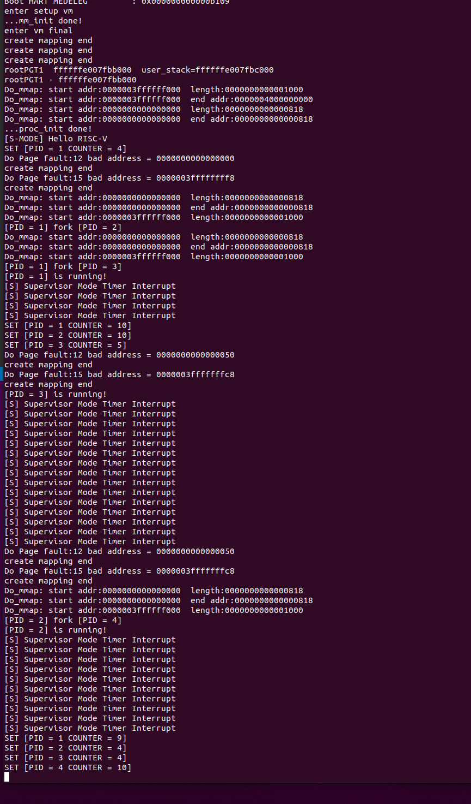

# 实验 5：RV64 缺页异常处理以及 fork 机制

## 1. 实验目的

* 通过 **vm_area_struct** 数据结构实现对进程**多区域**虚拟内存的管理。
* 在 **Lab4** 实现用户态程序的基础上，添加缺页异常处理 **Page Fault Handler**。
* 为进程加入 **fork** 机制，能够支持通过 **fork** 创建新的用户态进程。

## 2. 实验环境 

* Docker in Computer System Ⅱ Lab3

## 3. 背景知识

### 3.1 vm_area_struct 介绍

在linux系统中，`vm_area_struct` 是虚拟内存管理的基本单元， `vm_area_struct` 保存了有关连续虚拟内存区域(简称vma)的信息。linux 具体某一进程的虚拟内存区域映射关系可以通过 [procfs【Link】](https://man7.org/linux/man-pages/man5/procfs.5.html) 读取 `/proc/pid/maps` 的内容来获取:

比如，如下一个常规的 `bash` 进程，假设它的进程号为 `7884` ，则通过输入如下命令，就可以查看该进程具体的虚拟地址内存映射情况(部分信息已省略)。

```shell
#cat /proc/7884/maps
556f22759000-556f22786000 r--p 00000000 08:05 16515165                   /usr/bin/bash
556f22786000-556f22837000 r-xp 0002d000 08:05 16515165                   /usr/bin/bash
556f22837000-556f2286e000 r--p 000de000 08:05 16515165                   /usr/bin/bash
556f2286e000-556f22872000 r--p 00114000 08:05 16515165                   /usr/bin/bash
556f22872000-556f2287b000 rw-p 00118000 08:05 16515165                   /usr/bin/bash
556f22fa5000-556f2312c000 rw-p 00000000 00:00 0                          [heap]
7fb9edb0f000-7fb9edb12000 r--p 00000000 08:05 16517264                   /usr/lib/x86_64-linux-gnu/libnss_files-2.31.so
7fb9edb12000-7fb9edb19000 r-xp 00003000 08:05 16517264                   /usr/lib/x86_64-linux-gnu/libnss_files-2.31.so                 
...
7ffee5cdc000-7ffee5cfd000 rw-p 00000000 00:00 0                          [stack]
7ffee5dce000-7ffee5dd1000 r--p 00000000 00:00 0                          [vvar]
7ffee5dd1000-7ffee5dd2000 r-xp 00000000 00:00 0                          [vdso]
ffffffffff600000-ffffffffff601000 --xp 00000000 00:00 0                  [vsyscall]
```

从中我们可以读取如下一些有关该进程内虚拟内存映射的关键信息：

* `vm_start` :  (第1列) 指的是该段虚拟内存区域的开始地址
* `vm_end` :  (第2列) 指的是该段虚拟内存区域的结束地址
* `vm_flags` :  (第3列) 该 `vm_area` 的一组权限(rwx)标志， `vm_flags` 的具体取值定义可参考linux源代码的 [linux/mm.h](https://elixir.bootlin.com/linux/v5.14/source/include/linux/mm.h#L265)
* `vm_pgoff` :  (第4列) 虚拟内存映射区域在文件内的偏移量
* `vm_file` :  (第5/6/7列)分别表示：映射文件所属设备号/以及指向关联文件结构的指针(如果有的话，一般为文件系统的inode)/以及文件名

其它保存在 `vm_area_struct` 中的信息还有：

* `vm_ops` :  该`vm_area`中的一组工作函数
* `vm_next/vm_prev`: 同一进程的所有虚拟内存区域由**链表结构**链接起来，这是分别指向前后两个 `vm_area_struct` 结构体的指针

### 3.2 缺页异常 Page Fault

缺页异常是一种正在运行的程序访问当前未由内存管理单元（ MMU ）映射到虚拟内存的页面时，由计算机硬件引发的异常类型。访问未被映射的页或访问权限不足，都会导致该类异常的发生。处理缺页异常通常是操作系统内核的一部分。当处理缺页异常时，操作系统将尝试使所需页面在物理内存中的位置变得可访问（建立新的映射关系到虚拟内存）。而如果在非法访问内存的情况下，即发现触发 `Page Fault` 的虚拟内存地址（ Bad Address ）不在当前进程 `vm_area_struct` 链表中所定义的允许访问的虚拟内存地址范围内，或访问位置的权限条件不满足时，缺页异常处理将终止该程序的继续运行。 

#### 3.2.1 RISC-V Page Faults

RISC-V 异常处理：当系统运行发生异常时，可即时地通过解析csr scause寄存器的值，识别如下三种不同的Page Fault。


**SCAUSE** 寄存器指示发生异常的种类：

| Interrupt | Exception Code | Description            |
| --------- | -------------- | ---------------------- |
| 0         | 12             | Instruction Page Fault |
| 0         | 13             | Load Page Fault        |
| 0         | 15             | Store/AMO Page Fault   |

ecall指令的含义是向执行环境发出请求，我们在`lab4~6`中实现的`sbi_ecall`就是通过`ecall`向权限更高的M模式发送请求，完成类似于打印字符，设置时钟计时等。在本次实验中，我们只实现M模式，在执行指令`ecall`后会触发异常`Environmrnt call from M-mode`，需要对相关寄存器进行设置并跳转到异常处理地址。

异常指令的 PC 被保存在 mepc 中，PC 被设置为 mtvec。（对于同步异常，mepc 指向导致异常的指令；对于中断，它指向中断处理后应该恢复执行的位置。） 

根据异常来源设置 mcause（如图 10.3 所示），并将 mtval 设置为出错的地址或 者其它适用于特定异常的信息字。 (这个实验不需要)


#### 3.2.2 常规处理 **Page Fault** 的方式介绍

处理缺页异常时所需的信息如下：

* 触发 **Page Fault** 时访问的虚拟内存地址 VA。当触发 page fault 时，`stval` 寄存器被被硬件自动设置为该出错的VA地址
* 导致 **Page Fault** 的类型：
	* Exception Code = 12: page fault caused by an instruction fetch 
	* Exception Code = 13: page fault caused by a read  
	* Exception Code = 15: page fault caused by a write 
* 发生 **Page Fault** 时的指令执行位置，保存在 `sepc` 中
* 当前进程合法的 **VMA** 映射关系，保存在`vm_area_struct`链表中


1. mtvec(Machine Trap-Vector Base-Address Register)寄存器是可读可写寄存器，存储异常处理代码的地址，本次实验只需要实现`Direct`模式，即发生异常时跳转到mtvec所指向的地址进行处理。
2. mepc(Machine Exception Program Counter)寄存器是可读可写寄存器，存储发生异常时的地址。
3. mstatus(Machine Status Register)寄存器是可读可写寄存器，存储M模式下的异常相关的信息，在本次实验中我们只需要实现其中的`MIE(3)`即可。

### 3.3 `fork` 系统调用

* `fork()`通过复制当前进程创建一个新的进程，新进程称为子进程，而原进程称为父进程。
* 子进程和父进程在不同的内存空间上运行。
* 父进程`fork`成功时`返回：子进程的pid`，子进程`返回：0`。`fork`失败则父进程`返回：-1`。
* 创建的子进程需要拷贝父进程 `task_struct`、`pgd`、`mm_struct` 以及父进程的 `user stack` 等信息。
* Linux 中使用了 `copy-on-write` 机制，`fork` 创建的子进程首先与父进程共享物理内存空间，直到父子进程有修改内存的操作发生时再为子进程分配物理内存。

## 4 实验步骤

### 4.2 实现虚拟内存管理功能：

* 修改 `proc.h` 如下：

```c
/* vm_area_struct vm_flags */
#define VM_READ		0x00000001
#define VM_WRITE	0x00000002
#define VM_EXEC		0x00000004

struct vm_area_struct {
	struct mm_struct *vm_mm;    /* The mm_struct we belong to. */
	uint64 vm_start;          /* Our start address within vm_mm. */
	uint64 vm_end;            /* The first byte after our end address 
                                    within vm_mm. */

	/* linked list of VM areas per task, sorted by address */
	struct vm_area_struct *vm_next, *vm_prev;

	uint64 vm_flags;      /* Flags as listed above. */
};

struct mm_struct {
	struct vm_area_struct *mmap;       /* list of VMAs */
};

struct task_struct {
    struct thread_info* thread_info;
    uint64 state;
    uint64 counter;
    uint64 priority;
    uint64 pid;

    struct thread_struct thread;

    pagetable_t pgd;

    struct mm_struct *mm;
};
```

* 每一个 vm_area_struct 都对应于进程地址空间的唯一区间。
* 为了支持 `Demand Paging`（见 4.3），我们需要支持对 `vm_area_struct` 的添加，查找。
* `find_vma` 函数：实现对 `vm_area_struct` 的查找
	* 根据传入的地址 `addr`，遍历链表 `mm` 包含的 vma 链表，找到该地址所在的 `vm_area_struct `。
	* 如果链表中所有的 `vm_area_struct` 都不包含该地址，则返回 `NULL`。

```c
/*
* @mm          : current thread's mm_struct
* @address     : the va to look up
*
* @return      : the VMA if found or NULL if not found
*/
struct vm_area_struct *find_vma(struct mm_struct *mm, uint64 addr){
    if(mm == NULL) return NULL;
    struct vm_area_struct *temp = mm->mmap;
    if(temp == NULL) return NULL;
    while(temp->vm_next){
        if(temp->vm_start <= addr && temp->vm_end > addr){
            return temp;
        }
        temp = temp->vm_next;
    }
    if(temp->vm_start <= addr && temp->vm_end > addr){
            return temp;
    }
    else return NULL;
}
```

- `do_mmap` 函数：实现 `vm_area_struct` 的添加
	- 新建 `vm_area_struct` 结构体，根据传入的参数对结构体赋值，并添加到 `mm` 指向的 vma 链表中。
	- 需要检查传入的参数 `[addr, addr + length)` 是否与 vma 链表中已有的 `vm_area_struct` 重叠，如果存在重叠，则需要调用 `get_unmapped_area` 函数寻找一个其它合适的位置进行映射。

```c
/*
 * @mm     : current thread's mm_struct
 * @addr   : the suggested va to map
 * @length : memory size to map
 * @prot   : protection
 *
 * @return : start va
*/
uint64 do_mmap(struct mm_struct *mm, uint64 addr, uint64 length, int prot){
    printk("Do_mmap: start addr:%lx  length:%lx\n",addr, length);
        
    struct vm_area_struct *newnode = (struct vm_area_struct *)kalloc();
    newnode->vm_prev = NULL;
    newnode->vm_next = NULL;
    newnode->vm_flags = prot;
    newnode->vm_mm = mm;
    struct vm_area_struct *temp = mm->mmap;
    int flag = 0;
    if(temp == NULL){
        mm->mmap = newnode;
        newnode->vm_start = addr;
        newnode->vm_end = addr + length;
        return addr;
    }
    if(temp->vm_start > addr){//添加在链表最前面
        if(temp->vm_start <= addr + length){//页表前面没有空间，那就得放后面
            addr = get_unmapped_area(mm,length);
            flag = 1;
        }
        else{//页表前面有空间
            temp->vm_prev = newnode;
            newnode->vm_next = temp;
            mm->mmap = newnode;

            newnode->vm_start = addr;
            newnode->vm_end = addr + length;
            //printk("Do_mmap: start addr:%lx  end addr:%lx\n",newnode->vm_start, newnode->vm_end);
            return addr;
        }
    }
    while(temp->vm_next){           //addr必然在当前块start后面，再分end前、后讨论
        if(addr < temp->vm_end){   //如果addr在当前vma-end的前面，那必然冲突了
            if(!flag) addr = get_unmapped_area(mm, length);
            break;
        }
        if(addr >= temp->vm_end && addr < temp->vm_next->vm_start){ //如果addr在当前vma和下一个vma之间空挡
            if(temp->vm_next->vm_start < addr + length) //如果本次length会覆盖到下一个vma
                if(!flag) addr = get_unmapped_area(mm, length);
            break;//本次length不会覆盖下一个vma

        }
        temp=temp->vm_next;
    }

    newnode->vm_start = addr;
    newnode->vm_end = addr + length;
    if(temp->vm_next) temp->vm_next->vm_prev = newnode;
    newnode->vm_next = temp->vm_next;
    newnode->vm_prev = temp;
    temp->vm_next = newnode;
    return addr;
}
```

- `get_unmapped_area` 函数：用于解决 `do_mmap` 中 `addr` 与已有 vma 重叠的情况
	- 我们采用最简单的暴力搜索方法来寻找未映射的长度为 `length`（按页对齐）的虚拟地址区域。
	- 从 `0` 地址开始向上以 `PGSIZE` 为单位遍历，直到遍历到连续 `length` 长度内均无已有映射的地址区域，将该区域的首地址返回。

```c
uint64 get_unmapped_area(struct mm_struct *mm, uint64 length){
    uint64 *i, *j;
    //遍历vma链表寻找之中空的那个
    //printk("get unmapped area length %x\n",length);
    struct  vm_area_struct *temp = mm->mmap;
    //printk("mmap %lx - %lx\n",temp->vm_start, temp->vm_end);
    uint64 addr=0;
    if(length <= temp->vm_start) return addr;
    while(temp->vm_next){
        //printk("mmap %lx - %lx\n",temp->vm_start, temp->vm_end);
        if(temp->vm_next->vm_start - temp->vm_end >= length){
            return temp->vm_end;
        }
        temp = temp->vm_next;
    }
    return temp->vm_end;
}
```

### 4.3 Page Fault Handler

* `Demand Paging`
	* 在调用 `do_mmap` 映射页面时，我们不直接对页表进行修改，只是在该进程所属的 `mm->mmap` 链表上添加一个 `vma` 记录。
	* 当我们真正访问这个页面时，会触发缺页异常。在缺页异常处理函数中，我们需要根据缺页的地址，找到该地址对应的 `vma`，根据 `vma` 中的信息对页表进行映射。
* 修改 `task_init` 函数代码，更改为 `Demand Paging`
	* 删除之前实验中对 `U-MODE` 代码，栈进行映射的代码
	* 调用 `do_mmap` 函数，为进程的 vma 链表添加新的 `vm_area_struct` 结构，从而建立用户进程的虚拟地址空间信息，包括两个区域：
		* 代码区域, 该区域从虚拟地址 `USER_START` 开始，大小为 `uapp_end - uapp_start`， 权限为 `VM_READ | VM_WRITE | VM_EXEC`
		* 用户栈，范围为 `[USER_END - PGSIZE, USER_END)` ，权限为 `VM_READ | VM_WRITE`
* 在完成上述修改之后，如果运行代码我们可以截获一个 page fault。如下图 （注意：由于试例代码尚未正确处理 page fault， 所以我们可以看到一系列的 page fault ）

```bash 
// Instruction Page Fault
scause = 0x000000000000000c, sepc = 0x0000000000000000, stval = 0x0000000000000000 

// Store/AMO Page Fault: sepc 是 code address， stval 是 写入的地址 (位于 user stack 内)。
scause = 0x000000000000000f, sepc = 0x0000000000000070, stval = 0x0000003ffffffff8 

************************** uapp asm **************************
 .....

 Disassembly of section .text.main:

 000000000000006c <main>:
   6c:   fe010113                addi    sp,sp,-32
   70:   00113c23                sd      ra,24(sp) <- Page Fault
   74:   00813823                sd      s0,16(sp)
   78:   02010413                addi    s0,sp,32
   7c:   fbdff0ef                jal     ra,38 <fork>
   80:   00050793                mv      a5,a0
   84:   fef42223                sw      a5,-28(s0)
   88:   fe442783                lw      a5,-28(s0)

......
************************** uapp asm **************************
```

* 实现 Page Fault 的检测与处理
	* 修改`trap.c`，添加捕获 Page Fault 的逻辑。
	* 当捕获了 `Page Fault` 之后，需要实现缺页异常的处理函数  `do_page_fault`。
	* 在最后利用 `create_mapping` 对页表进行映射时，需要对 Bad Address 进行判断。若 Bad Address 在用户态代码段的地址范围内（即 `USER_START` 开始的一段内存），则需要将其映射到 `uapp_start` 所在的物理地址；若是其它情况，则用 `kalloc` 新建一块内存区域，并将 Bad Address 所属的页面映射到该内存区域。

```c
void do_page_fault(struct pt_regs *regs, unsigned long scause) {
    /*
    1. 通过 stval 获得访问出错的虚拟内存地址（Bad Address）
    2. 通过 scause 获得当前的 Page Fault 类型
    3. 通过 find_vm() 找到对应的 vm_area_struct
    4. 通过 vm_area_struct 的 vm_flags 对当前的 Page Fault 类型进行检查
        4.1 Instruction Page Fault      -> VM_EXEC
        4.2 Load Page Fault             -> VM_READ
        4.3 Store Page Fault            -> VM_WRITE
    5. 最后调用 create_mapping 对页表进行映射
    */
    uint64 bad_address = csr_read(stval);
    uint64 page_fault_kind = scause;
    int term=0b10001;//valid
    printk("Do Page fault:%d bad address = %lx\n",scause, bad_address);
    uint64 a = csr_read(satp);
    uint64 *pgtbl;
    pgtbl = ((unsigned long)current->pgd+ PA2VA_OFFSET);
    //printk("pgd:%lx  phy pgd = %lx\n",pgtbl,(unsigned long)pgtbl - PA2VA_OFFSET);
    struct vm_area_struct *temp = find_vma(current->mm, bad_address);
    if(temp == NULL){
        do_mmap(current->mm, bad_address, PGSIZE, 0);
        temp = current->mm->mmap;
    }
    else {
        term |= (temp->vm_flags << 1);
    }
    switch(page_fault_kind){
        case 12: temp->vm_flags |= VM_EXEC;  term |= 0b1000; break;//readable
        case 13: temp->vm_flags |= VM_READ;  term |= 0b0010; break;//writable
        case 15: temp->vm_flags |= VM_WRITE; term |= 0b0100; break;//executable
        default: break;
    }
    
    
    if(bad_address >= USER_START && bad_address < (USER_START + (unsigned long)uapp_end -  (unsigned long)uapp_start)){
        create_mapping(pgtbl, temp->vm_start, uapp_start - PA2VA_OFFSET, (unsigned long)uapp_end -  (unsigned long)uapp_start, 0b11111);
        //printk("direct linear map :%d bad address = %lx\n",scause, bad_address);
    }
    else if(temp->vm_start == USER_END - PGSIZE){
        unsigned long pa = current->user_sp - PGSIZE; // virtual address
        create_mapping(pgtbl, temp->vm_start, pa - PA2VA_OFFSET, PGSIZE, 0b10111);
    }
    else{
        uint64 pa = kalloc();//虚拟地址
        create_mapping(pgtbl, temp->vm_start, pa - PA2VA_OFFSET, PGSIZE, term);
    }
    //create_mapping(uint64 *pgtbl, uint64 va, uint64 pa, uint64 sz, int perm) 
}
```

### 4.4 实现 fork()

- 修改 `task_init` 函数中修改为仅初始化一个进程，之后其余的进程均通过 `fork` 创建。

* 修改 `task_struct` 增加结构成员 `trapframe`， 如下：

```c
struct task_struct {
    struct thread_info* thread_info;
    uint64 state;
    uint64 counter;
    uint64 priority;
    uint64 pid;

    struct thread_struct thread;

    pagetable_t pgd;

    struct mm_struct *mm;
    
    struct pt_regs *trapframe;
};
```

`trapframe` 成员用于保存异常上下文，当我们 `fork` 出来一个子进程时候，我们将父进程用户态下的上下文环境复制到子进程的 `trapframe` 中。当子进程被调度时候，我们可以通过 `trapframe` 来恢复该上下文环境。

* fork() 所调用的 syscall 为 `SYS_CLONE`，系统调用号为 220。

```c
#define SYS_CLONE 220
```

* 实现 `clone` 函数的相关代码如下， 为了简单起见 `clone` 只接受一个参数 `pt_regs *`。

```c
void forkret() {
    ret_from_fork(current->trapframe);
}

uint64 clone(struct pt_regs *regs) {
    return do_fork(regs);
}
```

* 实现 `do_fork` 

	* 参考 `task_init` 创建一个新的子进程，设置好子进程的 state, counter, priority, pid 等，并将该子进程正确添加至到全局变量 `task` 数组中。子进程的 counter 可以先设置为0，子进程的 pid 按照自定的规则设置即可（例如每 fork 一个新进程 pid 即自增）。
	* 创建子进程的用户栈，将子进程用户栈的地址保存在 `thread_info->user_sp` 中，并将父进程用户栈的内容拷贝到子进程的用户栈中。
	* 正确设置子进程的 `thread` 成员变量。
		* 在父进程用户态中调用 `fork` 系统调用后，`task` 数组会增加子进程的元数据，子进程便可能在下一次调度时被调度。当子进程被调度时，即在 `__switch_to` 中，会从子进程的 `thread` 等成员变量中取出在 `do_fork` 中设置好的成员变量，并装载到寄存器中。
		* 设置 `thread.ra` 为 `forkret`，设置 `thread.sp`, `thread.sscratch` 为子进程的内核栈 sp，设置 `thread.sepc` 为父进程用户态 `ecall` 时的 pc 值。
		* 类似 `task_init`，设置 `thread.sstatus`。
		* 同学们在实现这部分时需要结合 `trap_frame` 的设置，先思考清楚整个流程，再进行编码。
	* 正确设置子进程的 `pgd` 成员变量，为子进程分配根页表，并将内核根页表 `swapper_pg_dir` 的内容复制到子进程的根页表中，从而对于子进程来说只建立了内核的页表映射。
	* 正确设置子进程的 `mm` 成员变量，复制父进程的 vma 链表。
	* 正确设置子进程的 `trapframe` 成员变量。将父进程的上下文环境（即传入的 `regs`）保存到子进程的 `trapframe` 中。
		* 由于我们希望保存父进程在用户态下的上下文环境，而在进入 `trap_handler` 之前我们将 用户态 sp 与 内核态 sp 进行了交换，因此需要修改 `trapframe->sp` 为父进程的 用户态 sp。
		* 将子进程的 `trapframe->a0` 修改为 0。
	* 注意，对于 `sepc` 寄存器，可以在 `__switch_to` 时根据 `thread` 结构，随同 `sstatus`, `sscratch`, `satp` 一起设置好，也可以在 `ret_from_fork` 里根据子进程的 `trapframe` 设置。同时需要正确设置 `sepc + 4`。 选择自己喜欢的实现方式即可。
	* 返回子进程的 pid。

	```c
	
	uint64 do_fork(struct pt_regs *regs) { 
	    int sum=total_task, i=total_task;
	    task[i] = (struct task_struct *)kalloc(); 
	    task[i]->state =  TASK_RUNNING;
	    task[i]->counter = 0;
	    task[i]->priority = rand();
	    task[i]->pid = total_task;
	    task[i]->thread.ra = (uint64)forkret;
	    task[i]->thread.sp = (uint64)task[i] + PGSIZE;//s-MODE stack
	    task[i]->mm = (struct mm_struct *)kalloc();
	    task[i]->mm->mmap = NULL;
	    task[i]->trapframe = (struct pt_regs *)kalloc();
	    //set SUM(bit 18, so kernel mode can access user mode page), 
	    //set SPIE(bit 5, so interruption is enabled after sret), 
	    //set SPP to be 0, so after calling mret, the system can return to user mode 
	    task[i]->thread.sstatus =  csr_read(sstatus);
	    task[i]->thread.sstatus = task[i]->thread.sstatus | 0x00040020; 
	    csr_write(sstatus, task[i]->thread.sstatus); 
	
	    task[i]->thread.sepc =  regs->sepc;//父进程ecall时的pc
	    task[i]->thread.sscratch = (uint64)task[i] + PGSIZE;
	
	    total_task++;
	    unsigned long * user_stack = (unsigned long *)kalloc();//U-MODE栈的虚拟地址
	    task[i]->user_sp = (uint64)user_stack + PGSIZE;//u-MODE stack
	    for(int j=0; j<512; j++){
	        user_stack[j] = ((unsigned long*)(USER_END-PGSIZE))[j]; //拷贝用户栈的内容
	    }
	    
	    unsigned long* rootPGT = (unsigned long *)kalloc();////页表的虚拟地址 
	    task[i]->pgd = (unsigned long)((unsigned long)rootPGT - (unsigned long)PA2VA_OFFSET);//物理地址
	    for (int j = 0; j < 512; j++)
	    {
	        rootPGT[j] =  swapper_pg_dir[j];
	    }
	    
	    for(struct vm_area_struct *mmapi = current->mm->mmap; mmapi; mmapi = mmapi->vm_next){
	        do_mmap(task[i]->mm, mmapi->vm_start, mmapi->vm_end - mmapi->vm_start, mmapi->vm_flags);
	    }
	    current->trapframe = (struct pt_regs *)regs;
	    //copy trapframe 
	    task[i]->trapframe->sepc = regs->sepc; 
	    task[i]->trapframe->sstatus = regs->sstatus;
	    task[i]->trapframe->t6 = regs->t6; 
	    task[i]->trapframe->t5 = regs->t5; 
		……
	    task[i]->trapframe->ra = regs->ra;   
	    task[i]->trapframe->x0 = regs->x0;   
	    task[i]->trapframe->sp = csr_read(sscratch);//修改为父进程的用户态sp
	    task[i]->trapframe->a0 = 0;
	    return task[i]->pid;
	}
	```

	

* 参考 `_trap` 中的恢复逻辑，在 `entry.S` 中实现 `ret_from_fork`，函数原型如下：

	* 注意恢复寄存器的顺序
	* `_trap` 中是从 `stack` 上恢复，这里从 `trapframe` 中恢复

```c
void ret_from_fork(struct pt_regs *trapframe);
```

* 修改 Page Fault 处理：
	* 在之前的 Page Fault 处理中，我们对用户栈 Page Fault 处理方法是用 `kalloc` 自由分配一页作为用户栈并映射到 `[USER_END - PAGE_SIZE, USER_END)` 的虚拟地址。但由 `fork` 创建的进程，它的用户栈已经新建且拷贝完毕，因此 Page Fault 处理时直接为该已经分配的页建立映射即可（通过  `thread_info->user_sp` 来进行判断）。

## 思考题

根据同学们的实现，分析父进程在用户态执行 `fork` 至子进程被调度并在用户态执行的过程，最好能够将寄存器状态的变化过程清晰说明。

​	父进程在用户态执行ecall指令发起中断，被 _ traps捕获，切换到内核态的栈(sp  = 0xffffffe007fb5000, sscratch = 0x3fffffffc0)，在traphandler中调用clone函数do _ fork将子进程的task信息设置完成。创建子进程的过程在父进程的特权态执行，之后返回到 _ traps函数从父进程的特权态返回，切换到用户栈(sp = 0x3fffffffc0, sscratch = 0xffffffe007fb5000)。

​	在下一次schedule时子进程被调度，从用户态返回的时候，因为我们设置子进程的ra = forkret，所以会跳转到forkret的，而不是 _ traps中通过栈返回。forkret的时候会将sp设置为指向用户态栈和父进程一样的地方，sscratch设置为指向内核态栈。经过forkret中的sret返回到用户态父进程发生中断之后继续运行。

## 运行结果

1. 第一个main函数


第二个main函数


第三个main函数


